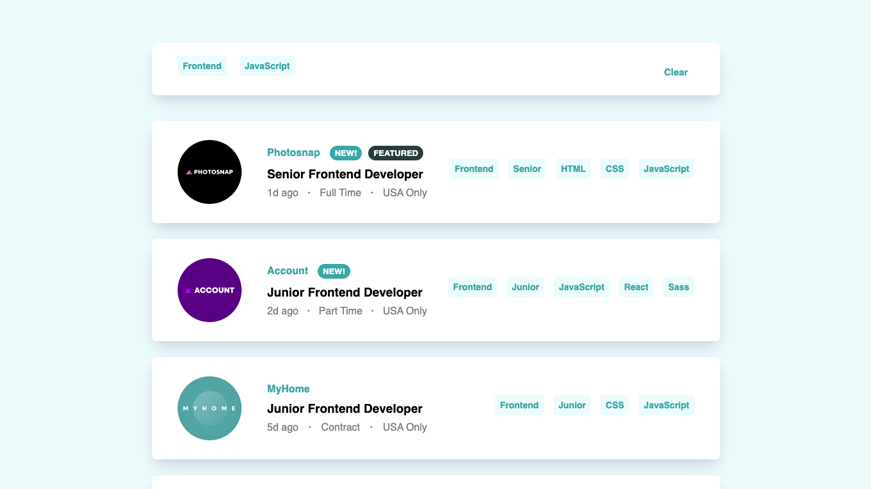

# Job Listings Page

## Table of contents

- [Overview](#overview)
  - [The challenge](#the-challenge)
  - [Screenshot](#screenshot)
- [My process](#my-process)
  - [Built with](#built-with)
  - [What I learned](#what-i-learned)
  - [Continued development](#continued-development)
- [Author](#author)

## Overview

This project is a Challenge obtained from the [Frontend Mentor](https://www.frontendmentor.io/) page.

### The challenge

Users should be able to:

- View the optimal layout for the site depending on their device's screen size
- See hover states for all interactive elements on the page
- Filter job listings based on the categories selected

### Screenshot

## My process

### Built with

- HTML
- CSS
- SASS preprocessor 
- JavaScript
- jQuery library

### What I learned

On this page I learned how to implement a JSON file to display the information contained, in addition to filtering the information depending on the categories selected by the user.

### Continued development

Make the page with real data possibly obtained from an API or integrating it to the JSON file already contained so that a list of real jobs is made.

## Author

Luis David Jimenez Martinez
- Portfolio - [www.luisdavidjm.com](https://www.luisdavidjm.com)
- GitHub - [LuisDavidJM](https://github.com/LuisDavidJM)
